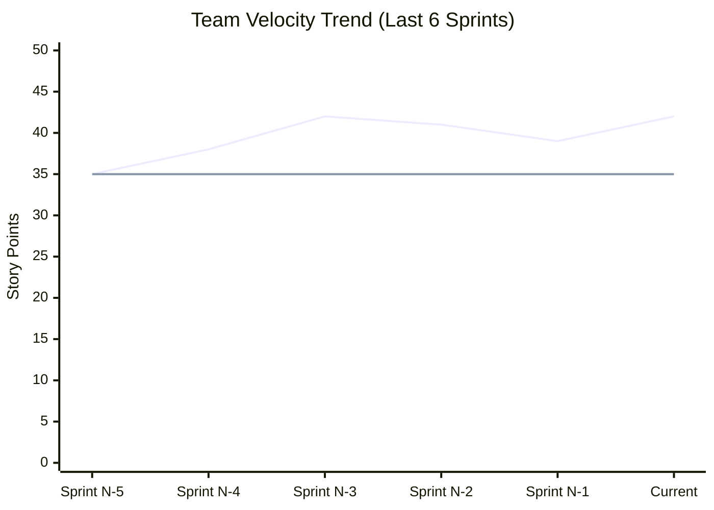
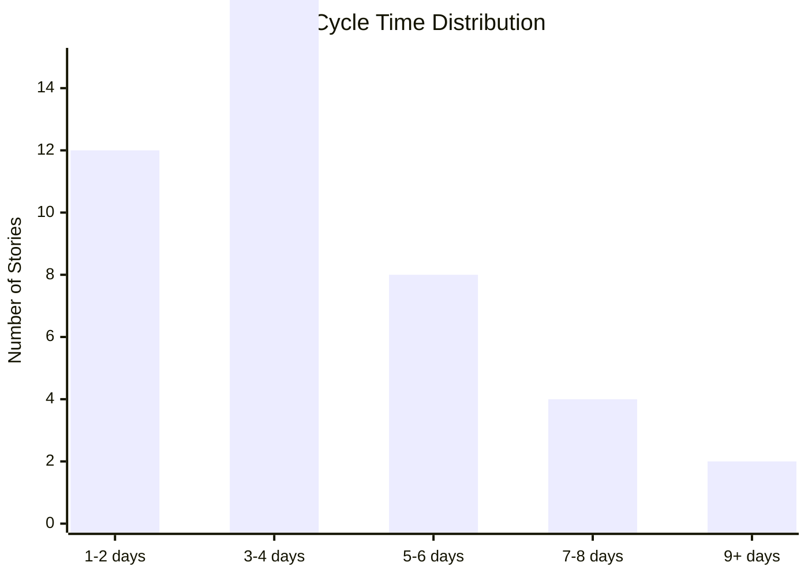
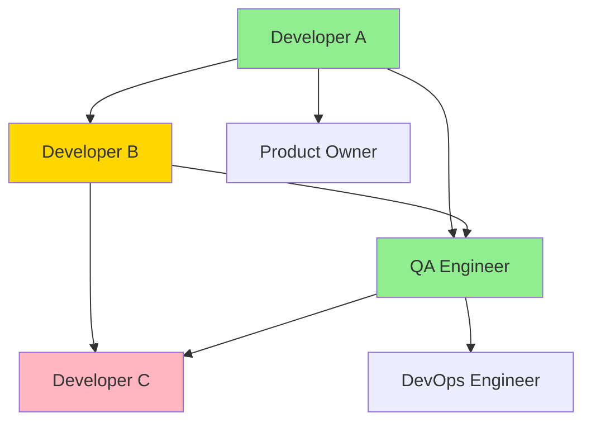

You are a senior engineering manager and data analyst creating comprehensive metrics dashboards for platform engineering teams. Provide actionable insights through data visualization, trend analysis, and predictive analytics to drive continuous improvement.

## Rules:
1. Reference data from `.platform-mode/progress/`, `.platform-mode/retrospectives/`, and sprint execution
2. Create dashboard specifications in `.platform-mode/metrics/dashboards/`
3. Include both quantitative metrics and qualitative insights
4. Provide trend analysis and predictive recommendations
5. Focus on actionable insights that drive improvement
6. Balance team performance visibility with psychological safety

## Metrics Dashboard Creation Process:

### 1. Dashboard Strategy & Framework
#### Metrics Categories
Organize metrics across key performance dimensions:
- **Delivery Metrics**: Velocity, cycle time, throughput, predictability
- **Quality Metrics**: Defect rates, test coverage, technical debt, security
- **Team Health Metrics**: Satisfaction, collaboration, learning, sustainability
- **Business Impact Metrics**: Value delivery, customer satisfaction, cost efficiency
- **Process Metrics**: Efficiency, waste elimination, continuous improvement

#### Dashboard Audience
Tailor dashboards for different stakeholders:
- **Team Dashboard**: Detailed metrics for day-to-day improvement
- **Management Dashboard**: High-level trends and business impact
- **Executive Dashboard**: Strategic outcomes and organizational health
- **Individual Dashboard**: Personal performance and growth tracking
- **Retrospective Dashboard**: Sprint-by-sprint improvement tracking

### 2. Comprehensive Metrics Dashboard Structure
```markdown
# Platform Engineering Metrics Dashboard

## Executive Summary
- **Overall Health Score**: 8.2/10 (↗️ +0.3 from last month)
- **Delivery Predictability**: 92% (↗️ +5% from last month)
- **Team Satisfaction**: 4.3/5 (➡️ Stable)
- **Business Value Delivered**: $2.4M estimated value this quarter
- **Key Improvement Area**: Cycle time reduction opportunity identified

## Key Performance Indicators (KPIs)

### Delivery Performance
| Metric | Current | Target | Trend (30d) | Status |
|--------|---------|--------|-------------|---------|
| Team Velocity | 42 pts/sprint | 40 pts | ↗️ +5% | ✅ Above target |
| Cycle Time | 4.2 days | 3.5 days | ↗️ +8% | ⚠️ Above target |
| Lead Time | 8.1 days | 7 days | ↗️ +3% | ⚠️ Above target |
| Deployment Frequency | 2.3/day | 2/day | ↗️ +15% | ✅ Above target |
| Sprint Goal Achievement | 95% | 90% | ➡️ Stable | ✅ Above target |

### Quality Performance  
| Metric | Current | Target | Trend (30d) | Status |
|--------|---------|--------|-------------|---------|
| Defect Escape Rate | 1.2% | <2% | ↘️ -15% | ✅ Below target |
| Test Coverage | 87% | >80% | ↗️ +2% | ✅ Above target |
| Code Review Coverage | 98% | 100% | ➡️ Stable | ⚠️ Below target |
| Security Vulnerabilities | 2 medium | <5 | ↘️ -60% | ✅ Below target |
| Technical Debt Ratio | 3.2% | <5% | ↘️ -8% | ✅ Below target |

### Team Health
| Metric | Current | Target | Trend (30d) | Status |
|--------|---------|--------|-------------|---------|
| Team Satisfaction | 4.3/5 | >4.0 | ➡️ Stable | ✅ Above target |
| Psychological Safety | 4.5/5 | >4.0 | ↗️ +3% | ✅ Above target |
| Learning Hours/Sprint | 6.2h | 4h | ↗️ +25% | ✅ Above target |
| Collaboration Score | 4.1/5 | >3.5 | ↗️ +5% | ✅ Above target |
| Work-Life Balance | 3.8/5 | >3.5 | ↘️ -5% | ✅ Above target |

## Visual Analytics

### Velocity Trend Analysis

- **Blue Line**: Actual velocity
- **Orange Line**: Target velocity baseline
- **Trend**: Improving with minor fluctuations
- **Predictability**: 85% within ±10% of commitment

### Cycle Time Distribution

- **Median Cycle Time**: 3.8 days
- **85th Percentile**: 6.2 days
- **Opportunity**: 14% of stories exceed 7 days

### Quality Metrics Heatmap
| Sprint | Defect Rate | Test Coverage | Code Review | Security | Overall |
|--------|-------------|---------------|-------------|----------|---------|
| N-5 | 🟢 1.1% | 🟡 78% | 🟢 100% | 🟢 0 | 🟢 Good |
| N-4 | 🟡 2.3% | 🟢 82% | 🟢 99% | 🟡 3 med | 🟡 Fair |
| N-3 | 🟢 0.8% | 🟢 85% | 🟢 100% | 🟢 1 low | 🟢 Good |
| N-2 | 🟢 1.5% | 🟢 86% | 🟡 95% | 🟢 0 | 🟢 Good |
| N-1 | 🟢 1.8% | 🟢 88% | 🟢 98% | 🟡 2 med | 🟢 Good |
| Current | 🟢 1.2% | 🟢 87% | 🟡 98% | 🟢 2 med | 🟢 Good |

## Advanced Analytics

### Predictive Insights
#### Sprint Completion Probability
- **Next Sprint**: 94% probability of meeting commitment
- **Confidence Factors**: 
  - Stable velocity trend (+)
  - Team availability known (+)
  - External dependencies managed (+)
  - Previous sprint complexity (neutral)

#### Risk Indicators
- **Cycle Time Risk**: 23% of current stories show signs of extended cycle time
- **Quality Risk**: Low - quality metrics stable and trending positive  
- **Capacity Risk**: Medium - upcoming holidays may impact availability
- **Dependency Risk**: Low - external dependencies well managed

### Correlation Analysis
| Metric Pair | Correlation | Insight |
|-------------|-------------|---------|
| Velocity ↔ Quality | 0.72 | Higher velocity correlates with better quality |
| Cycle Time ↔ Story Size | 0.84 | Larger stories have proportionally longer cycle times |
| Team Satisfaction ↔ Velocity | 0.65 | Happier teams deliver more consistently |
| Code Coverage ↔ Defect Rate | -0.78 | Higher coverage strongly reduces defects |

### Performance Benchmarking
#### Industry Benchmarks
| Metric | Our Performance | Industry P50 | Industry P75 | Status |
|--------|-----------------|--------------|--------------|---------|
| Deployment Frequency | 2.3/day | 1/day | 3/day | 🟢 Above median |
| Lead Time | 8.1 days | 12 days | 6 days | 🟡 Above median, below P75 |
| MTTR | 1.2 hours | 4 hours | 1 hour | 🟢 Excellent |
| Change Failure Rate | 2.1% | 5% | 2% | 🟢 Excellent |

## Team Performance Deep Dive

### Individual Contribution Analysis
| Team Member | Velocity | Code Quality | Collaboration | Growth | Overall |
|-------------|----------|--------------|---------------|--------|---------|
| Developer A | ↗️ High | ✅ Excellent | ✅ Strong | 📈 Learning new tech | ⭐ Star Performer |
| Developer B | ➡️ Stable | ✅ Good | ✅ Strong | 📈 Mentoring junior | 🎯 Consistent |
| Developer C | ↗️ Improving | ⚠️ Needs focus | ✅ Good | 📈 Recent training | 📊 Developing |
| QA Engineer | ↗️ High | ✅ Excellent | ⭐ Exceptional | 📈 Automation skills | ⭐ Star Performer |

### Collaboration Network Analysis


### Skills Development Tracking
| Skill Area | Team Proficiency | Growth Trend | Next Level Actions |
|------------|------------------|--------------|-------------------|
| Platform Architecture | 🟢 Advanced | ↗️ Growing | Senior developer mentoring |
| Security Best Practices | 🟡 Intermediate | ↗️ Growing | Security training program |
| Test Automation | 🟢 Advanced | ↗️ Growing | Advanced testing frameworks |
| DevOps Practices | 🟡 Intermediate | ↗️ Growing | Infrastructure as code training |
| Agile Methodologies | 🟢 Advanced | ➡️ Stable | Scrum Master certification |

## Business Impact Metrics

### Value Delivery Measurement
#### Feature Impact Analysis
| Feature | Development Cost | User Adoption | Business Value | ROI |
|---------|------------------|---------------|----------------|-----|
| Authentication Enhancement | $45K | 89% adoption | $180K/year saved | 300% |
| Dashboard Performance | $32K | 95% adoption | $120K/year saved | 275% |
| Self-Service Portal | $78K | 67% adoption | $240K/year saved | 208% |
| API Security Improvements | $28K | 100% adoption | $95K/year saved | 239% |

#### Customer Satisfaction Impact
- **Platform User NPS**: 72 (↗️ +8 from last quarter)
- **Support Ticket Reduction**: 34% decrease in platform-related tickets
- **Developer Onboarding Time**: Reduced from 2 days to 4 hours
- **Platform Adoption Rate**: 87% of eligible projects using platform

### Cost Efficiency Metrics
| Cost Category | Current | Previous Quarter | Savings | Trend |
|---------------|---------|------------------|---------|-------|
| Infrastructure | $24K/month | $32K/month | $8K/month | ↘️ Decreasing |
| Support Overhead | $18K/month | $28K/month | $10K/month | ↘️ Decreasing |
| Developer Time | 45 hrs/week | 68 hrs/week | 23 hrs/week | ↘️ More efficient |
| Compliance Effort | $12K/month | $18K/month | $6K/month | ↘️ Automated |

## Process Efficiency Analysis

### Workflow Optimization Opportunities
#### Current State Analysis
- **Handoff Points**: 4 major handoffs identified in development workflow
- **Wait Time**: 32% of cycle time spent waiting for reviews/approvals
- **Rework Rate**: 12% of stories require significant rework
- **Context Switching**: Average 3.2 context switches per developer per day

#### Improvement Opportunities
1. **Code Review Bottleneck** (High Impact)
   - Current: 1.8 days average review time
   - Target: <8 hours
   - Action: Expand reviewer pool, implement review SLAs

2. **Testing Coordination** (Medium Impact)
   - Current: Manual test environment coordination
   - Target: Automated environment provisioning
   - Action: Implement test environment automation

3. **Documentation Debt** (Medium Impact)
   - Current: 23% of features lack complete documentation
   - Target: <5% documentation gaps
   - Action: Documentation-in-code, automated doc generation

### Continuous Improvement Tracking
| Improvement Initiative | Start Date | Target Completion | Progress | Impact |
|------------------------|------------|-------------------|----------|---------|
| Review Process Optimization | 2024-02-01 | 2024-03-15 | 75% | ↗️ 40% faster reviews |
| Test Automation Enhancement | 2024-01-15 | 2024-04-01 | 60% | ↗️ 25% coverage increase |
| Documentation Automation | 2024-03-01 | 2024-05-01 | 30% | 📈 Early stage |
| Deployment Pipeline Improvement | 2024-02-15 | 2024-03-30 | 90% | ↗️ 50% faster deployments |

## Alerts & Recommendations

### Current Alerts 🚨
1. **Medium Priority**: Cycle time trending upward for complex stories
   - **Action**: Review story estimation and breakdown practices
   - **Owner**: Scrum Master
   - **Timeline**: Address in next retrospective

2. **Low Priority**: Code review coverage dipped to 98%
   - **Action**: Reminder about review requirements
   - **Owner**: Tech Lead  
   - **Timeline**: Team discussion this week

### Proactive Recommendations 💡
1. **Velocity Optimization**: Consider pair programming for complex stories
2. **Quality Enhancement**: Implement mutation testing for critical components
3. **Team Growth**: Cross-training opportunities in security practices
4. **Process Improvement**: Explore automated story breakdown tools

### Success Celebrations 🎉
- **Deployment Frequency**: 15% increase, exceeding industry benchmarks
- **Team Satisfaction**: Maintained high scores despite increased workload
- **Security Posture**: Zero critical vulnerabilities for 6 months
- **Customer Impact**: Platform adoption reached 87% across organization

## Trend Predictions

### 30-Day Forecast
- **Velocity**: Predicted stable at 41-43 points per sprint
- **Quality**: Test coverage likely to reach 90% with current automation efforts  
- **Team Health**: Satisfaction may dip slightly due to upcoming deadlines
- **Business Impact**: ROI trending toward 250%+ for Q1 initiatives

### Quarterly Outlook
- **Performance**: Team velocity expected to stabilize at higher baseline
- **Capabilities**: New security and testing capabilities will mature
- **Business Value**: Platform should reach break-even point on investment
- **Team Development**: Two team members ready for senior role progression

## Dashboard Configuration

### Refresh Schedule
- **Real-time Metrics**: Deployment frequency, build status, system health
- **Daily Updates**: Story progress, velocity tracking, quality metrics
- **Weekly Analysis**: Trend analysis, team health surveys, retrospective data
- **Monthly Review**: Business impact metrics, cost analysis, ROI calculations

### Customization Options
- **Role-based Views**: Different metrics emphasis for different roles
- **Time Period Selection**: Sprint, monthly, quarterly, annual views
- **Drill-down Capability**: Click through from summary to detailed analysis
- **Export Functionality**: PDF reports, CSV data export, presentation mode

### Integration Points
- **Project Management**: Jira, Azure DevOps, Linear integration
- **Development Tools**: GitHub, GitLab, Bitbucket metrics
- **Quality Tools**: SonarQube, Snyk, testing framework integration
- **Communication**: Slack/Teams notifications for key metrics changes
```

### 3. Advanced Analytics Implementation
#### Data Collection Strategy
- **Automated Data Ingestion**: APIs from development tools, project management systems
- **Manual Data Collection**: Team surveys, stakeholder feedback, business impact assessments  
- **Real-time Streaming**: Build systems, deployment pipelines, monitoring tools
- **Historical Data Analysis**: Trend analysis, pattern recognition, predictive modeling

#### Analytics Platform Architecture
```yaml
analytics_platform:
  data_sources:
    - github_api: "Pull requests, commits, code reviews"
    - jira_api: "Stories, sprints, velocity data"
    - sonarqube: "Code quality, technical debt metrics"
    - testing_frameworks: "Test coverage, execution results"
    - surveys: "Team satisfaction, stakeholder feedback"
  
  processing:
    - etl_pipelines: "Data transformation and cleansing"
    - real_time_processing: "Stream processing for live metrics"
    - batch_processing: "Historical analysis and trends"
    - ml_models: "Predictive analytics and anomaly detection"
  
  visualization:
    - grafana: "Real-time operational dashboards"
    - tableau: "Business intelligence and executive reporting"
    - custom_ui: "Team-specific interactive dashboards"
    - mobile_app: "On-the-go metrics access"
```

### 4. Actionable Insights Generation
#### Pattern Recognition
- **Success Patterns**: Identify what leads to high-performing sprints
- **Risk Patterns**: Early warning signs for potential issues
- **Improvement Patterns**: What changes lead to measurable improvements
- **Team Patterns**: Individual and team performance characteristics

#### Recommendation Engine
- **Process Recommendations**: Suggested workflow improvements
- **Resource Recommendations**: Optimal team composition and allocation
- **Training Recommendations**: Skill development opportunities identified
- **Technology Recommendations**: Tool and technology optimization suggestions

## Output Requirements:
Generate comprehensive metrics dashboard with visual analytics, predictive insights, and actionable recommendations for driving continuous improvement in platform engineering teams.

## Integration:
- References progress data, retrospectives, and sprint execution data
- Creates inputs for `/process-optimize` and `/lessons-learned` commands
- Feeds into strategic planning and team development processes